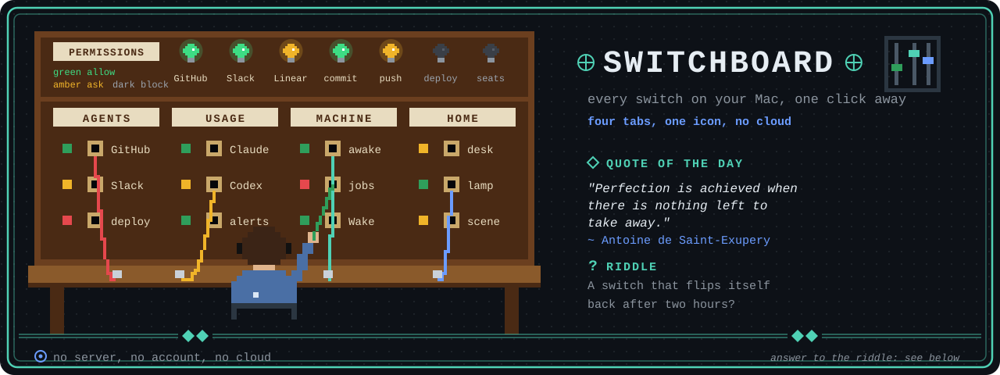
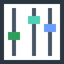
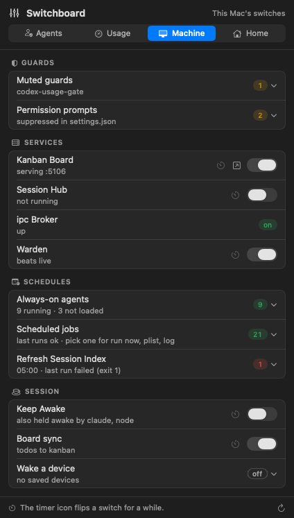
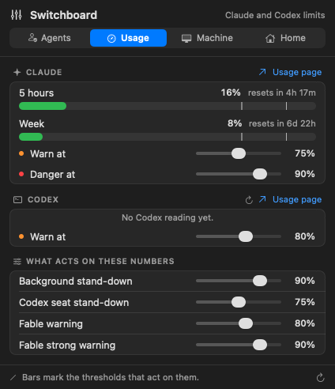
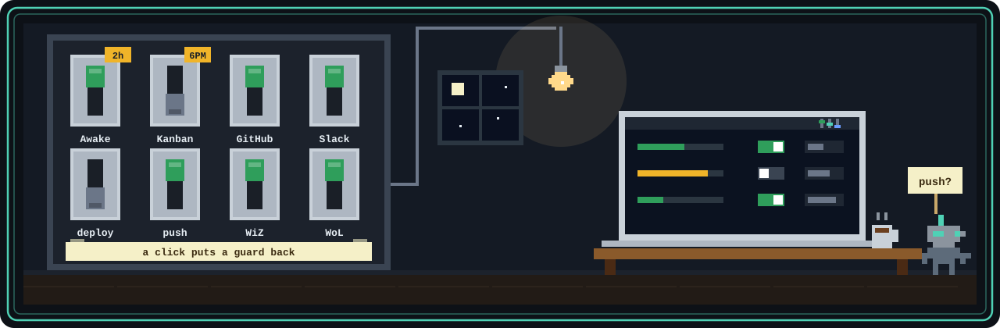

<p align="center">
  
</p>

#  switchboard-mac

<p align="center">
  
  
  
  
</p>


Switchboard is a menu bar app for the switches you would otherwise hunt for in
five places: keeping the Mac awake, which background jobs are failing, the
lights in the room, how much of your Claude and Codex quota is left, and what
your AI agents are allowed to do on your behalf. One icon, one panel, and a
tab per question, any of which you can hide in Settings.

It is small on purpose. There is no server, no account and no cloud: the panel
reads files and runs a few short scripts when you open it or flip a switch.

## What is in the panel

Tabs sit in five spaces along the top. Settings and Approvals are buttons in
the header, and Approvals appears only while something waits on you.

- Claude: Agents (what your agents may do as you), Usage, Claude MCP, Hooks and Library.
- Records: the Ledger of recurring mistakes, proposals and checkpoints, and the Queue of what is lined up to happen later.
- Desk: Notes (one markdown file each, with reminders) and Timers.
- Mac: Machine (Keep Awake, drives, repos), Runtime (services, dev servers, databases, local models, schedules) and Controls (sound, screen, Wi-Fi, Bluetooth).
- Around: Home (WiZ bulbs) and Remote (your other machines, through csync).

Rest the pointer on the menu bar icon and a small card opens with a launcher
for the tabs you use most and a badge for each thing that needs you. Scroll
over the icon to page through limits, approvals, bulbs and pinned notes.

<p align="center">
  
  
</p>

Any plain switch can be flipped for a while: "Keep Awake for 2 hours",
"Kanban off until 6 PM". The timer survives a restart, and it never undoes a
change you made by hand in between.

One rule shapes every switch: a click can put a protection back, but never
take one away. The one exception, turning off a Claude Code permission prompt,
asks you first.

<p align="center">
  
</p>

## Install

You need macOS 13 or later, the Xcode command line tools (`xcode-select --install`)
and python3.

```bash
git clone https://github.com/alcatraz627/switchboard-mac
cd switchboard-mac
scripts/build.sh --install    # builds Switchboard.app, copies it to ~/Applications, starts at login
```

Look for the three faders in your menu bar. To try it without installing,
`scripts/build.sh` builds and launches it from `build/`.

Or download the zip from [Releases](https://github.com/alcatraz627/switchboard-mac/releases)
and move the app to `~/Applications`. It is not notarized, so the first time,
right-click the app and choose Open (details in [docs/dev/releasing.md](docs/dev/releasing.md)).

The app has no Dock icon and no window. To quit it, run `pkill -x Switchboard`, or quit it from Activity Monitor.

## Works best with Claude Code

Most of the Claude tabs (Agents, Hooks, Ledger, Queue, Library and Claude MCP)
read a personal Claude Code setup in `~/.claude`, and show nothing useful
without one. Each integration is optional: when a tool is not installed, its
row or tab is not shown. On a plain Mac you get Keep Awake, schedules,
wake-on-LAN, the WiZ bulbs, and Claude usage if a statusline writes it. The
full list of what needs what is in [docs/dev/architecture.md](docs/dev/architecture.md#optional-integrations).

## Documentation

Start at [docs/README.md](docs/README.md). The [user guide](docs/user/guide.md)
walks through every tab, and the [changelog](CHANGELOG.md) lists what changed
in each release.

## Contributing

Issues and pull requests are welcome. Start with the notes for developers in
[docs/dev](docs/dev/architecture.md): how the app is put together, how to
[add a tab](docs/dev/adding-a-tab.md), the [design kit](docs/dev/design-kit.md)
and how to run it [without a screen](docs/dev/architecture.md#headless-checks).
Before opening a pull request, run `tests/run-tests.sh` and, for a UI change,
`scripts/snapshots.sh`, and look at both appearances.

## License

[MIT](LICENSE)
