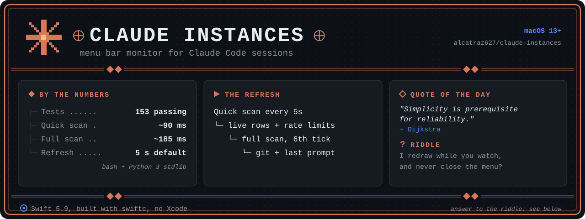
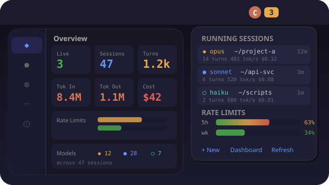

<p align="center">
  
</p>

<h1 align="center"> Claude Instances</h1>

<p align="center">
  Native macOS menu bar app for monitoring and managing concurrent Claude Code sessions.
</p>

<p align="center">
  
  
  
  
  
</p>

---

<!-- ── Preview (full UI mockup) ─────────────────────────────────────────────── -->
<details>
<summary><b>UI preview</b>, menu bar dropdown (the preview predates the hub; sessions now open there) (click to expand)</summary>

<div align="center">



</div>

</details>

---

<details>
<summary>Riddle answer</summary>

A view-based menu item: LiveRowView mutates in place while the menu is held open, so ctx %, tokens and cost tick without a reopen.

</details>

## About

A native macOS menu bar widget that gives you instant visibility into all your running
Claude Code sessions. Live-updating instance rows show model, branch, ctx %, tokens, cost,
memory, last user prompt, and active state, without ever closing the menu. Click any
instance to open it in Finder / Terminal / VSCode, or read its transcript from your phone
over Tailscale via the session hub.

Built as a small set of Swift files compiled with `swiftc` (no Xcode project, no external
dependencies, no package managers). Just `bash native/build.sh --install` and it runs
forever via LaunchAgent.

### Tiered Refresh

The widget uses a two-tier scan strategy for responsiveness without overhead:

| Tier | Interval | Duration | Scope |
|------|----------|----------|-------|
| **Quick scan** (`--quick`) | User-selectable (default 5s) | ~90ms | Live instances + rate limits |
| **Full scan** | Every 6th tick (~30s by default) | ~185ms | + history, events, aggregates, git enrichment, last user prompt |

Quick scans replace the live array but **preserve per-instance enrichment fields**
(`gitBranch`, `gitModified`, `lastPrompt`) from the previous full scan via
`LiveInstance.preservingEnrichment(from:)`, so branch info doesn't flicker off every
5 seconds.

The user can change the refresh cadence from the menu (Refresh submenu: 1/2/5/10/30/60s
or Pause), and the timer reconstructs itself on change.

## Tests

```bash
bash tests/run-tests.sh
```

Runs **153 smoke tests** covering: bash syntax of every script, swift compile of the
split bar sources as one module, JSON shape of `scan.sh` (full + `--quick`), the shared
design primitives (`BarFont`, `seg`/`row`/`columned`, `middleTruncate`/`tailTruncate`,
`severityToken`), the live-row rebuild (ctx bar, middle-truncated paths, Copy Directory /
Copy Resume submenu actions), the rate usage-zones (warn/danger thresholds, `zoneColor`
driving both bars and icon, drawn track+fill views), the collapsed Events + History
submenus with tab-stop alignment, the session hub (`hub-server.py` routes, tailnet
binding, an in-process `/healthz` spin-up), the legacy `detail.sh` fallback HTML, and the
Settings infrastructure (`PaletteStore`, all 17 palette tokens, hover + reverse-highlight
wiring, Appearance / Menu Behavior / Refresh & Warnings / Row Visibility sections).

No external test framework, just bash + Python 3 stdlib.

## Quick Start

```bash
# Build, sign, and register as a LaunchAgent (auto-starts on login)
bash native/build.sh --install

# Or just build and run once (no auto-start)
bash native/build.sh
```

The Claude logo appears in your menu bar. Click it to see your running sessions.

## Features

### Menu Bar Icon

- Static coral Claude logo PNG, dims to 50% when no instances are running
- Instance count badge in monospaced font (or `–` when idle)
- Worst-window usage % appended in the zone colour: orange in the warn zone (≥70% by
  default), red in the danger zone (≥90%). No `⚠` glyph; the colour is the signal, the
  dropdown carries the per-window detail. Below the warn zone, no percentage shows
- Shows `⚠ N` on the count badge when permission requests are pending

### Switchboard

The faders icon (agent policy, usage limits, machine switches, smart bulbs) is
its own app now: [switchboard-mac](https://github.com/alcatraz627/switchboard-mac).
The dropdown's **Switchboard** action opens it, launching it first if needed.
Its Usage tab moves the same warn and danger zones this icon is coloured by;
it mirrors them into this app's preferences and asks the icon to redraw.

### Dropdown Menu (min-width 340pt), live-updating

The per-instance rows are **view-based** (`NSMenuItem.view = LiveRowView`) so they
mutate in place while the menu is held open. AppKit's standard `attributedTitle` items
can't redraw mid-display; view-based items can, and that's what makes the elapsed
time, ctx %, tokens, cost, RAM all tick smoothly without close + reopen.

**What you see per instance:**

- **Header**: model badge (◆ opus / ● sonnet / ○ haiku) · a tinted SF-Symbol state glyph
  when active · leaf folder name · elapsed time · `↳N` subagent count (when present) ·
  a permission badge (`P` plan / `A` auto-accept-edits) when not in default mode ·
  `⎇branch` · `*N` modified-file count (yellow <20, soft red ≥20)
- **Tab title** (when distinct from leaf folder): `⌥ <terminal tab topic>`
- **Full path**: middle-truncated to one line, full path on hover
- **State detail** (when active): `thinking: <detail>` / `responding` / `tool_use: <name>`.
  One unified SF-Symbol glyph lives in the header; this line carries no second emoji
- **Last user prompt**: `❯ <preview>`
- **Last tool**: `last: <name> <target> · <ago> ago` (suppressed once a session has
  been idle for more than 5 minutes)
- **Metrics**: `ctx N%` with a short severity-coloured bar beside it (red <30 / yellow
  <60 / green ≥60) · `Nt` turns · `🔧N` tools · `↑NK` output tokens · `$N.NN` cost ·
  `NMB` memory · `Nt/s` rate
- **Compaction warning** (when ctx <15%): soft red row
- **Focus file**: `📄 <path>`, middle-truncated to one line, full path on hover
- **MCP-down warning** (when present): soft red

Every line above can be toggled off in Settings > Refresh & Warnings > Row Visibility.

Click an instance row to open its submenu: **Open in Finder / Terminal (Ghostty) /
VSCode**, **View Transcript** (opens the session hub), **Copy PID**, **Copy Directory
Path**, **Copy Resume Command**, **Terminate**. The Finder/Terminal/VSCode trio sits at
the top to match the user mental model.

**Other menu sections:**

- **Rate limits**: 5h + 7d usage bars (drawn track + fill, not ASCII) with a countdown
  until reset (`⏱ 5h 52% resets ~2h 18m` / `📅 7d 12% resets ~5d 3h`). The fill colour
  comes from the usage zones below. Two zone thresholds are configurable via the **Usage
  zones** submenu: a warn slider (default ≥70%) and a danger slider (default ≥90%). Same
  two zones colour the menu-bar icon. The framing is deliberate: a usage cap is a signal,
  not a wall to avoid.
- **Usage stats**: Today / Week aggregates, sessions, turns, cost, inline model badge
  counts.
- **Recent events**: collapsed to a single `Recent Events (N)` row with a submenu; rows
  carry per-type Unicode symbols, semantic colors, and inline model badges.
- **History**: collapsed to a single `History (N)` row with a submenu; click a session to
  resume via `claude --resume` in a new Ghostty tab.
- **All sessions in the hub**: one row that opens the session hub's board in the browser.
- **Actions**: New Session (Cmd+N), Settings… (Cmd+,), Sessions (phone), Switchboard, one-click
  **Refresh Now** (Cmd+R) with the cadence + last-scan age inline, an **Auto-refresh
  interval** submenu (1/2/5/10/30/60s + Pause, persisted), Terminate All, Quit Widget.
- **Footer**: "Updated Ns ago · refresh: cadence", escalates when paused.

### Legacy transcript viewer (`detail.sh`)

The menu's **View Transcript** now opens the session hub (see below). The older per-pid
viewer described here is a standalone fallback that the bar no longer drives. You can still
invoke it directly: `detail.sh` spawns a per-pid localhost HTTP server
(`lib/detail-server.py`, port `5400 + pid % 500`) and opens the page via
`http://127.0.0.1:<port>/...`, required because Chrome blocks `fetch()` between two
`file://` URLs.

**Live update mechanics:**
- JS poller calls `/regen` every 30s, the server runs `bash detail.sh --regen` synchronously
  and returns 200
- Page fetches itself, extracts `#msgs` innerHTML, **swaps in place**, no full reload, no
  flicker, all state preserved (theme, search, scroll, expanded `<details>`)
- Server self-exits on: Claude PID death (60s watcher) · 10-min idle (no requests) ·
  2-hour hard deadline · SIGTERM/SIGINT/SIGHUP. The idle timeout means closing the browser
  tab eventually cleans up the server even if Claude is still running.
- Disk writes are atomic (`os.replace(tmp, output)`) so the poller never reads a half-
  written file.

**What you see on the page:**

| Section | Detail |
|---|---|
| **Header** | AI-generated session title · model · PID · session id · `⎇branch` · permission-mode pill · refresh time pill |
| **Stats row** | Input / Output / Cache Read / Turns counts |
| **Metrics bar** | CTX% (color-coded) · CPU · MEM · MCP-up list · MCP-down (red) · CWD (copyable chip) |
| **Tools used** | Horizontal-bar breakdown by tool name with counts |
| **Activity timeline** | Clickable colored dots (one per turn) · click to jump to that block · flash on arrival |
| **Toolbar** | Search-as-you-type · role chips (You / Claude / Tools) · ↻ Refresh · live pulse |
| **Conversation** | Markdown via `marked.js` + `highlight.js` (CDN): headings, lists, tables, blockquotes, syntax-highlighted code. Auto-links bare URLs. |
| **Tool calls** | Grouped + expandable. Each shows tool name, copyable file paths, full input JSON. `Edit` → red/green-tinted side-by-side OLD/NEW with language-specific highlighting. `Bash` → highlighted command + description. |
| **Inline events** | `⚙ N hooks ran` · `🔓 permission mode → auto` · `↳ subagent` markers |
| **Block index + timestamp** | Each card has a `#N` index badge; HH:MM:SS with full-datetime tooltip |
| **Flow arrows** | Color-tinted connectors between consecutive cards showing the next speaker |
| **Theme toggle** | Light/dark; persists across reloads via localStorage |
| **State persistence** | Search, chip toggles, scroll position survive reload via sessionStorage |

### Session Hub: read your sessions from your phone

The menu bar's **View Transcript** and the **Sessions (phone)** action both open
the *session hub*: one long-lived server that serves a live index of every
session and each session's transcript, reachable from any device on your
Tailscale network.

```bash
bash lib/hub.sh start      # prints the URL to open (localhost + tailnet)
bash lib/hub.sh status     # is it running? where is it bound?
bash lib/hub.sh stop
```

**Why a hub instead of the old per-pid servers:** discovery. Your phone can't
guess that a session lives on port `5400 + pid % 500`. The hub is one address,
the index page is the entry point, and every session is one tap away.

**Routes** (`lib/hub-server.py`):

| Route | Serves |
|---|---|
| `GET /` | the session index (`lib/hub-index.html`), live cards + rate bars + recent list |
| `GET /s/<session-id>` | that session's transcript SPA (`lib/transcript-app.html`) |
| `GET /s/<session-id>/data` | the normalized transcript JSON (`lib/transcript.py`); `?since=` / `?agent=` supported |
| `GET /api/sessions` | the index's live feed (reshaped `scan.sh` output) |

**Tailnet scoping:** the hub binds to this Mac's Tailscale address
(`100.64.0.0/10`) when Tailscale is up, so it is reachable from your tailnet but
not from a public or café LAN. With Tailscale down it falls back to `127.0.0.1`
(localhost only). **Sessions (phone)** copies the tailnet URL to your clipboard
when available, so it is one paste away on your phone.

**The viewer** (the SPA) shows full multi-day transcripts with no truncation
(paginated), whole-transcript search, an activity ribbon, sub-agent drill-in,
and 8-second live append, all mobile-first. Tool calls render richly: `Edit` /
`Write` as colored diffs, `Bash` as a command block, with copy-as-markdown (which
works over plain http too) and a jump-to-latest button. Dark default, light toggle.

### Settings window (SwiftUI)

The native dashboard was retired: every session, live or ended, is on the session
hub's board, and the menu's **All sessions in the hub** row opens it. What stays
native is one standalone window, **Settings…** (Cmd+,), with these sections:

| Section | What it sets |
|-----|-------------|
| **Appearance** | System / Light / Dark for this Settings window |
| **Widget Menu** | Palette editor with bidirectional hover preview, Tailwind colour picker, per-token reset |
| **Menu Behavior** | Row density |
| **Display Sizing** · **Menu Bar Badge** | Menu sizes and what the menu-bar badge counts |
| **Refresh & Warnings** · **Row Visibility** | Refresh cadence, usage zones, which rows show |
| **Keybinds** | Per-action submenu shortcuts |

### Settings → Widget Menu (palette editor)

The Settings window includes a centrally-tunable color palette for the menu. **17 palette
tokens**, each persisting to UserDefaults as a hex string under `palette.<token>`:

| Token | Used for |
|---|---|
| `model.opus` / `.sonnet` / `.haiku` | Per-model badge color |
| `metric.turns` / `.tools` / `.speed` | Nt / 🔧N / Nt/s ambient skim counts (neutral gray) |
| `metric.tokens` / `.cost` / `.memory` | ↑K / $ / MB values in the metrics row |
| `accent.branch` / `.subagent` | `⎇branch` and `↳N` badges |
| `state.active` | Active state-detail row (thinking/responding/tool_use) |
| `warn.high` / `.mid` | Compaction-imminent, MCP-down, modified ≥20 (high); ctx <60%, modified <20 (mid) |
| `success.high` | Healthy state, ctx ≥60%, fast token rate |
| `permission.plan` / `.auto` | The `P` plan-mode and `A` auto-accept-edits badges |

The defaults are a harmonious perceptual-tier palette: identity (models) and severity
(green/amber/red, shared by warnings and permission badges) stay vivid, ambient metrics
sit in a low-chroma band, and turns/tools/speed go neutral gray (meaning comes from their
label and position). Background and principles live in
[`docs/color-palette-research.md`](docs/color-palette-research.md) and
`~/.claude/conventions/visual-design.md`.

**How it works:**

- **`PaletteStore` singleton** holds baked-in defaults + UserDefaults overrides. Posts a
  notification on change.
- **Bar's color constants** (`menuRed`, `costColor`, etc.) are computed `var`s that read
  `PaletteStore.shared.color(for: token)` at call time, user changes propagate to the
  next render with no cache to invalidate.
- **Single renderer for both surfaces**, the Settings preview pane wraps the same
  `LiveRowView` NSView the actual menu uses, via `NSViewRepresentable`. Zero drift
  between preview and menu.
- **Bidirectional hover-highlight**, hover a line in the preview → matching palette
  row gets a translucent accent background + the token name surfaces in a pill chip
  above the preview. Hover a palette row → matching label inside the preview gets the
  same translucent background (`controlAccentColor` 20%). Implemented via NSTrackingArea
  on the preview's NSView; hover state is shared through SwiftUI `@State`.
- **Tailwind color picker**, 13 hues × 5 shades (300/400/500/600/700) = 65 swatches in
  a labeled grid. Hover shows `rose-400 · #FB7185`. Current selection ringed in accent.
- **Per-token Reset**, disabled when the token is at its default; resetting clears
  the UserDefaults override. **Reset all to defaults** wipes every override.

**System text colors** (`labelColor`, `secondaryLabelColor`, etc.) are intentionally
NOT in the palette, they auto-adapt to dark/light mode via AppKit semantics and
shouldn't be tunable.

### Settings → Appearance

System / Light / Dark picker for the Settings window, via
`NSApp.appearance = NSAppearance(named: ...)`. Persisted under `appearance.mode`. The
menu's translucent material follows the OS regardless, and the hub pages keep their
own dark/light switch.

### Settings → Menu Behavior

- **Density** (compact / cozy / comfortable), controls the `stack.spacing`
  of LiveRowView. `densitySpacing()` is read on every `update()`, so the change
  applies on the next refresh tick. Notification: `.menuBehaviorDidChange` →
  BarDelegate calls `refreshLiveRows()`.

## Architecture

```
+--------------------------------------------------------------------------+
|  DATA SOURCES                                                            |
|  scan.sh (JSON)     /tmp/claude-statusline-*     ~/.claude/projects      |
|  statusline.sh -->  ~/.claude/widgets/.limits.json  (5h + 7d, resets)    |
+-----+----------------------+--------------------+-----------------------+
      | 5s/30s tiered        | metrics            | on-demand
      v                      v                    v
+--------------------------------------------------------------------------+
|  CORE                                                                    |
|  BarDelegate -->  ScanResult Cache                                      |
|     quick scan: merge live (preserving enrichment from prev full scan)   |
|     full scan:  replace everything (history, events, aggregates, git)    |
+-----+----------------------+--------------------+-----------------------+
      | menuNeedsUpdate      | refreshLiveRows    | Settings…
      | + delegate hooks     | (every tick when   |
      v                      | menu is open)      v
+----------------------------+   +---------------------------------------+
|  NSMenu Dropdown                |  Settings window (SwiftUI)           |
|  . Rate limit bars (+ resets)   |  . Appearance, Widget Menu palette   |
|  . Usage stats (today / week)   |  . Menu Behavior, sizing, badge      |
|  . Live instances (view-based,  |  . Refresh & Warnings, visibility    |
|    live-updating LiveRowView)   |  . Keybinds                          |
|  . Recent events                |                                      |
|  . Session history              |  +------------------------------+    |
|  . All sessions in the hub      |  |  Settings preview ↔ palette  |    |
|  . Actions (Cmd+N, Cmd+,)       |  |  bidirectional hover state   |    |
+----------------+----------------+  |  via shared @State binding   |    |
                 |                   +--------------+---------------+    |
                 v                                  v
+--------------------------------------------------------------------------+
|  PaletteStore (singleton)                                                |
|  . 17 tokens, baked-in defaults + UserDefaults overrides                 |
|  . postNotification on change → BarDelegate refreshLiveRows + updateButton
+--------------------------------------------------------------------------+
                 |
                 v
+----------------+--------------------------------------------------------+
|  ACTIONS (AppleScript + Process + subprocess)                            |
|  focusGhosttyTab() resumeSession() terminate() openHubTranscript()       |
|  openHubIndex() openInFinder() openInVSCode() copyPID()                  |
|  copyDirPath() copyResumeCmd()                                           |
+----------------+--------------------------------------------------------+
                 |
                 v        +-------------------------+
       Ghostty Terminal   |  hub-server.py          |--> Chrome / phone
                          |  one tailnet server     |    (index + per-session
                          |  GET / · /s/<id>        |     transcript SPA,
                          |  /s/<id>/data · /api    |     live append)
                          +-------------------------+
```

### File Structure

```
~/.claude/widgets/claude-instances/
├── native/                          # The bar, split into 8 files, one swiftc module
│   ├── main.swift                   # Paths, logging, format helpers, app entry
│   ├── Models.swift                 # Codable models, enums, small helpers
│   ├── Palette.swift                # PaletteToken + PaletteStore + NSColor helpers
│   ├── DesignKit.swift              # Shared design system (type scale, builders, truncation)
│   ├── Actions.swift                # Ghostty/resume, file open, hub bridge, scanner
│   ├── LiveRowView.swift            # The live instance row NSView
│   ├── Bar.swift                    # BarDelegate + menu builders
│   ├── Settings.swift               # SwiftUI Settings sections
│   ├── SettingsWindowController.swift # The standalone Settings window
│   ├── claude-logo.svg              # Menu-bar icon
│   ├── color-sampler.swift          # Internal: vibrancy color preview tool
│   ├── build.sh                     # Compile (swiftc -O native/*.swift) + install + manage
│   └── .build-info                  # Auto-generated build metadata
├── lib/
│   ├── scan.sh                      # Python scanner → JSON output (~950 lines)
│   ├── transcript.py                # Parses a session .jsonl into a clean JSON model
│   ├── transcript-app.html          # Data-first transcript SPA (served by the hub)
│   ├── hub-server.py                # Session hub, index + per-session transcript over the tailnet
│   ├── hub-index.html               # Hub landing page, live index of all sessions
│   ├── hub.sh                       # Hub lifecycle: start/stop/status/url
│   ├── detail.sh                    # Legacy per-pid transcript generator (fallback)
│   └── detail-server.py             # Legacy per-pid localhost server (fallback)
├── tests/
│   ├── run-tests.sh                 # Smoke-test suite (153 tests)
│   └── fixtures/sample-session.jsonl
├── assets/
│   ├── banner.svg
│   └── preview.svg
├── gotchas.md                       # Developer pitfall log
├── UPGRADE-PLAN.md                  # Shipped + parked work tracker
└── README.md                        # This file
```

### Key Components

| Component | Role |
|-----------|------|
| `BarDelegate` | `NSApplicationDelegate` + `NSMenuDelegate`. Manages status item, menu, tiered scan timers, action handlers. `menuWillOpen` triggers an immediate refresh for fresh-on-open data. |
| `LiveRowView` | `NSView`. Renders one live instance as a vertical stack of NSTextFields. Mutates in place via `update(with: LiveInstance, ...)` so menu rows tick while open. Tracks per-label palette tokens for hover. |
| `LiveRowViewRepresentable` | `NSViewRepresentable`. Embeds `LiveRowView` in SwiftUI for the Settings preview, single renderer, zero drift between preview and menu. |
| `PaletteStore` | Singleton. 17 user-tunable color tokens + defaults + UserDefaults overrides. Posts `didChangeNotification` on every mutation. |
| `ScanResult` | Codable struct decoded from `scan.sh` JSON. Live instances, history, events, rate limits, aggregates. |
| `LiveInstance` | Per-instance data. Includes `preservingEnrichment(from:)` so quick scans don't wipe git/prompt fields. |
| `SettingsWindowController` | Owns the standalone Settings window; hosts `SettingsTabView` in an `NSHostingController`. |
| `SettingsTabView` | Palette editor + Appearance picker + Menu Behavior and the other sections. Bidirectional preview ↔ palette hover via shared `@State hoveredToken`. |
| `TailwindPicker` | 13 × 5 swatch popover. Hover shows `<hue>-<shade> · #HEX`. |
| `focusGhosttyTab()` | AppleScript bridge, finds and focuses the Ghostty tab matching a working directory. |
| `resumeSession()` | AppleScript, opens a new Ghostty tab, cd's to the project, runs `claude --resume`. |
| `openInVSCode()` | Spawns `code <path>` via PATH; falls back to NSWorkspace `/Applications/Visual Studio Code.app` open. |

### Data Models

| Struct | Source | Key Fields |
|--------|--------|------------|
| `LiveInstance` | scan.sh | pid, model, modelFull, cwd, elapsed, turns, inputTokens, outputTokens, costUsd, toolCalls, sessionState, subagentCount, statusline, **gitBranch, gitModified, lastPrompt, permissionMode, lastTool** |
| `SessionState` | scan.sh | state (thinking/responding/tool_use/idle), detail |
| `StatuslineMetrics` | `/tmp/claude-statusline-<pid>` | cpu, mem, rssMb, focusFile, tokSpeed, costVel, ctxRemaining, walSinceCp, mcpDown, mcpHealthy |
| `SessionHistory` | scan.sh | sessionId, project, model, turns, sizeKb, modified, tokensIn, tokensOut, costUsd |
| `FullSession` | All Sessions scan | sessionId, project, projectDirName, model, turns, sizeKb, modified, tokensIn, tokensOut, jsonlPath |
| `Event` | scan.sh | event, ts, project, sessionId, model, tabTitle, tool |
| `RateLimits` | scan.sh (via .limits.json) | fiveH (pct/used/cap), week (pct/used/cap), **resetsAt, resetsAtWeekly** |
| `Aggregates` | scan.sh | today/week (sessions, turns, tokensIn, tokensOut, costUsd), modelBreakdown |
| `PaletteToken` | hard-coded enum | 17 cases: modelOpus/Sonnet/Haiku, metricTurns/Tools/Tokens/Cost/Memory/Speed, accentBranch/Subagent, stateActive, warnHigh/Mid, successHigh, permissionPlan/Auto |

### Data Flow: Rate Limits

Rate limit percentages flow through a cross-process cache:

1. **Claude Code** pipes session status JSON (including `rate_limits.{five_hour,seven_day}.{used_percentage,resets_at}`)
   to `statusline.sh` on every tool use/notification
2. **statusline.sh** parses the percentages + reset timestamps and writes them as a
   side-effect to `~/.claude/widgets/.limits.json` (keys: `5h`, `week`, `resets_at`,
   `resets_at_weekly`)
3. **scan.sh** reads the cache file (in both quick and full scans) and includes it in
   the JSON output as `limits`
4. **Swift widget** decodes `RateLimits` and renders the progress bars in the menu,
   with a countdown until each window resets

### Data Flow: Palette → Render

1. **User** picks a Tailwind swatch in Settings → `PaletteStore.shared.set(token, hex:)`
2. **PaletteStore** writes UserDefaults key `palette.<token>` and posts
   `PaletteStore.didChangeNotification`
3. Two listeners fire simultaneously:
   - **PaletteObservable** (`@StateObject` in SettingsTabView) bumps its `version` →
     SwiftUI re-renders preview + palette rows
   - **BarDelegate** (registered in `applicationDidFinishLaunching`) calls
     `refreshLiveRows()` → every visible live menu row's `update(with:)` re-runs
4. **LiveRowView.update()** reads `PaletteStore.shared.color(for: token)` for each label
picks up the new value
5. **Both surfaces reflect the change**, preview within ~1 frame, actual menu within
   the scan tick (default 5s)

### Default Palette

Tier groupings follow the harmonious palette. Every value is overridable in Settings.

| Token | Default | Tier |
|-------|---------|------|
| `model.opus` | `#C2740E` | Identity (loud) |
| `model.sonnet` | `#3B6FD4` | Identity (loud) |
| `model.haiku` | `#0E97A6` | Identity (loud) |
| `success.high` | `#2E9E58` | Severity (green→amber→red) |
| `warn.mid` | `#C98A12` | Severity |
| `warn.high` | `#CE4B43` | Severity |
| `permission.plan` | `#C98A12` | Severity (amber, shares the scale) |
| `permission.auto` | `#CE4B43` | Severity (red, shares the scale) |
| `metric.cost` | `#B98A1F` | Money (gold, offset from severity-amber) |
| `metric.tokens` | `#3F9A63` | Money |
| `metric.memory` | `#6E8EC0` | Ambient (low-chroma) |
| `accent.branch` | `#4F9D9A` | Ambient |
| `state.active` | `#4F9D9A` | Ambient |
| `accent.subagent` | `#5C93B8` | Ambient |
| `metric.turns` | `#8A8A8E` | Skim counts (neutral gray) |
| `metric.tools` | `#8A8A8E` | Skim counts |
| `metric.speed` | `#8A8A8E` | Skim counts |

These are the light-tuned values; a dark-appearance variant is a planned follow-up.

## Build Management

```bash
bash native/build.sh              # Compile + launch (replaces running instance)
bash native/build.sh --install    # Compile + register LaunchAgent (auto-start)
bash native/build.sh --uninstall  # Remove LaunchAgent + kill widget
bash native/build.sh --logs       # Tail the debug log
bash native/build.sh --status     # Show running instances + build info
```

### LaunchAgent

When installed via `--install`, the widget registers as a LaunchAgent
(`dev.claude-instances.menubar`) that:

- Starts automatically on login (`RunAtLoad`)
- Restarts on crash (`KeepAlive.SuccessfulExit = false`)
- Logs to `~/Library/Logs/ClaudeInstances/bar.log` (rotated at 1 MB → `bar.log.1`)
  - Format: `<ISO8601> [pid] [INFO|WARN|ERROR] <msg>`
  - Tail live: `tail -F ~/Library/Logs/ClaudeInstances/bar.log`
  - Errors only: `grep '\[ERROR\]' ~/Library/Logs/ClaudeInstances/bar.log`

### Dedupe

The app kills any existing `claude-instances-bar` processes on startup via `pgrep`/`kill`,
ensuring only one instance runs at a time even if launched manually while the LaunchAgent
is active.

## Dependencies

- **macOS 13+** (Ventura), for `NavigationSplitView`, `.ultraThinMaterial`
- **Swift 5.9+**, ships with Xcode 15+
- **Ghostty**, for tab focus via AppleScript (falls back to generic activation)
- **Python 3**, used by `scan.sh`, the session hub (`hub-server.py`, `transcript.py`), and the legacy `detail.sh` / `detail-server.py`
- **Tailscale** (optional), to reach the session hub from your phone. Without it the hub binds to localhost only
- No external Swift packages. No Xcode project. The Swift sources compile as one `swiftc` module.

For the live transcript viewer:
- **Google Chrome** preferred (the page opens via `open -a "Google Chrome"`; falls back
  to default browser)
- **marked.js + highlight.js** loaded from jsDelivr CDN (cached after first load)

## Troubleshooting

| Problem | Fix |
|---------|-----|
| Two icons in menu bar | Hover over the stale one (macOS clears ghost icons on hover). Or: `bash build.sh --uninstall && bash build.sh --install` |
| Icon not appearing | Check `bash build.sh --status`. If not running, `tail ~/Library/Logs/ClaudeInstances/bar.log` |
| Menu shows "Scanning..." | `scan.sh` may be failing. Test with `bash lib/scan.sh` directly |
| Branch / last-prompt missing | Full scan hasn't run yet (happens every 6 quick ticks ≈ 30s). Try clicking ↻ Refresh Now in the menu |
| Live menu rows don't update | Make sure the binary is current: `bash build.sh --status` and look for "binary matches source" |
| Palette change didn't apply | Notification fires but a stale `LiveRowView` may not have rebuilt. Close + reopen the menu once |
| Transcript page won't load | `lsof -i :<port>` for `5400 + (pid % 500)`. Server may have hit idle/death timeout; click View Transcript again |
| No rate limit bar | Requires an active Claude session for statusline.sh to write `.limits.json`. Check: `cat ~/.claude/widgets/.limits.json` |
| Settings won't open | Requires macOS 13+. Check logs for SwiftUI errors |
| "Focus" doesn't switch tabs | Ghostty must have Accessibility permission in System Settings |

## License

MIT
